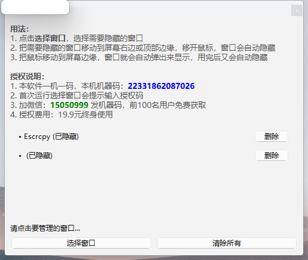

# 1. 介绍
它可以让你把任意窗口（比如聊天软件、工具条等）像QQ那样，自动隐藏到屏幕的右边或顶部边缘，需要时只要把鼠标移动到屏幕边缘，窗口就会自动弹出来显示，用完后又会自动隐藏，非常方便桌面空间管理和多任务操作。
# 2. 编译说明

## 2.1 环境准备

1. 确保已安装 Python 3.x
2. 安装所需依赖包:

```
python -m pip install PyQt6 pywin32 pyinstaller

python -m PyInstaller window_manager.spec

```
## 2.2 本地trae调试

```
git add .
git commit -m "add github actions"
git push -u origin main

python -m PyInstaller  .\window_manager.spec
.\dist\window_manager.exe

```

# 3. 直接运行

从发行版本下载后直接运行即可、见截图



直接点击【选择窗口】，选择你需要隐藏的窗口，然后移动窗口到桌面顶部或右边边缘，移开鼠标就自动隐藏

最终实现的效果如下：


上图演示了，我把安卓手机镜像到PC桌面，操作手机就和操作本地QQ一样方便，同时把便签在需要的时候可以快速激活，提升我们的工作效率

# 4. 常见问题

4.1 为什么需要授权码才能用？

此程序非通用产品，开放设计需要时间，下载到桌面为单文件，能运行就能使用，直接联系窗口上的微信，获取授权码。

4.2 为什么定价19.9 元？

一杯咖啡的价格，希望大家能支持一下。

4.3 为什么限制一机一码？

因为没有更多精力维护授权码系统，使用最简单的方式，限制一机一码，不换电脑可以一直使用，换电脑请重新联系我购买。

4.4 为什么不提供试用？

程序非常直观，一看演示就能明白，试用的意义不大。